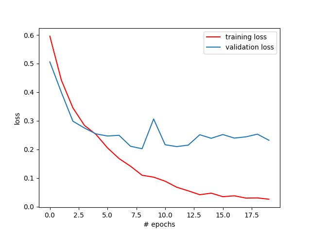
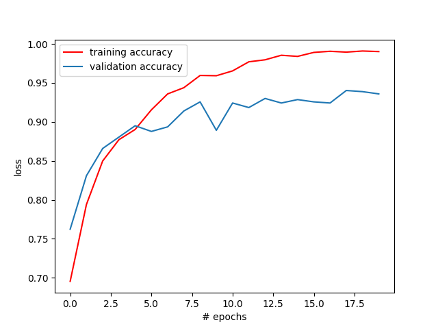

# Make-app-facemask-detect

<h1>Dịch thì viết code giết bọ qua ngày!</h1> 
<h2>Đầu tiên mình tìm dataset trên mạng, gồm mấy trăm tấm hình khuôn mặt đeo khẩu trang, với mấy trăm tấm hình khuôn mặt không đeo khẩu trang. Để tất cả trong file dataset</h2> 
<h2>Tiếp theo mình viết code python vào file <b><i>data_pre.py</i></b> để tạo hai tệp mã hóa 2 thư mục with_mask và no_mask</h2> 
<h2>Tiếp theo tiếp theo, mình training máy tính bằng mô hình thuật toán CNN, cho nó học hai thư mục đã mã hóa ở trên. Mình viết code trong file <b><i>training_cnn.py</i></b></h2> 

<h2>Trong file <i>detect_facemask.py</i>, mình viết đoạn code xuất video realtime từ webcam laptop, viết thêm một số hàm nhận diện khuôn mặt sử dụng thư viện haar_cascade và sử dụng dữ liệu mình vừa train cho máy tính để nhận diện khẩu trang trên khuôn mặt.</h2> 
<h2>Trong file mainwindow.py, outwindow.py mình viết code hiển thị 2 file UI là mainwindow.ui và outwindow.ui, 2 file này mình làm bằng Qt Designer, để hiển thị phần hình của App.</h2>  
<h2>Have Fun!</h2>
